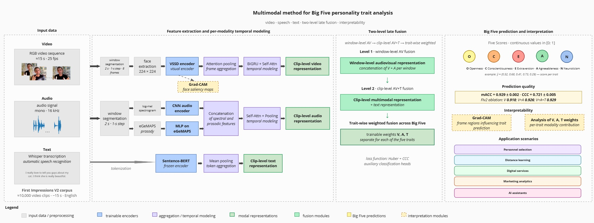
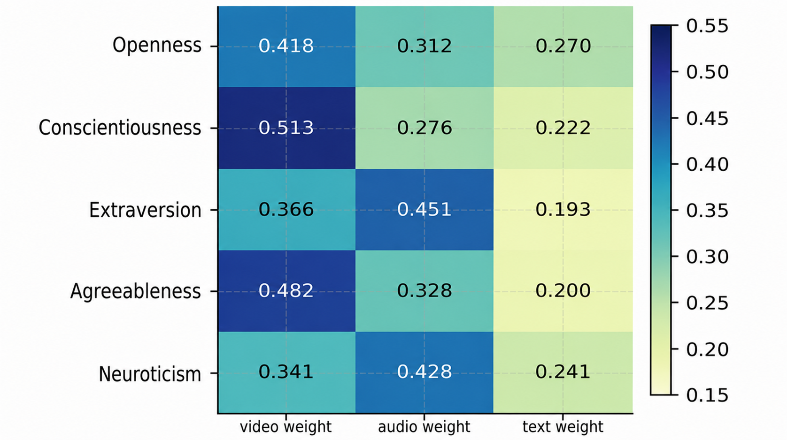
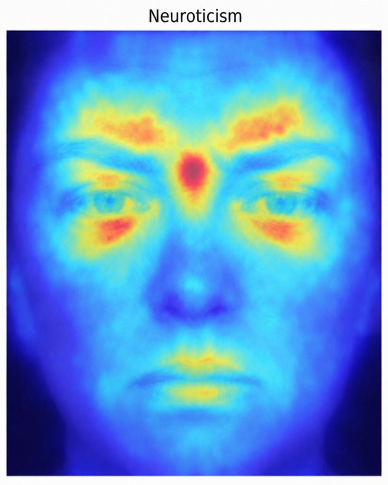

<div align="center">

# VSSD-Trait

### An interpretable multimodal Big Five personality regressor on First Impressions V2

[](https://www.python.org/)
[](https://pytorch.org/)
[](https://github.com/YuHengsss/VSSD)
[](notebooks/FIv2_VSSD_extended_experiments_colab.ipynb)
[](LICENSE)

**`mACC = 0.929 ± 0.002`** &nbsp;·&nbsp;
**`CCC = 0.721 ± 0.005`** on the FIv2 test split with **63 M trainable parameters**.

</div>

---

## Abstract

VSSD-Trait is an **end-to-end audio-visual-textual model** for predicting the
five soft personality scores of the
[**First Impressions V2**](https://chalearnlap.cvc.uab.cat/dataset/24/description/)
(FIv2) corpus. It combines a **VSSD-Small** state-space-duality vision
backbone with a compact 2-D-CNN audio branch (log-mel + prosody +
eGeMAPS) and a frozen SBERT text branch (`all-MiniLM-L6-v2`), fused
through a **two-level late-fusion gate** — window-level for audio+visual,
clip-level for the text addition — with **per-trait** softmax weights.

The model reaches **mACC = 0.929** on the FIv2 test split with only
**63 M trainable parameters** — on par with the strongest published
multimodal systems (CAT-BE, GSFN, SSL-MEPR) at **2–2.5 × fewer
parameters** and lower memory / latency. Interpretability is built
into the architecture at three levels: modality (gate weights),
temporal (window attention) and spatial (Grad-CAM saliency).

This repository contains the full reproducibility package for the
extended experimental section of the dissertation:

* a runnable Colab notebook
  ([`notebooks/FIv2_VSSD_extended_experiments_colab.ipynb`](notebooks/FIv2_VSSD_extended_experiments_colab.ipynb))
  that reproduces every table from end to end;
* a Python package (`src/av_traits/`) with cleanly factored data /
  model / training / evaluation modules;
* one CLI script per experiment (`scripts/`);
* every CSV table and PNG figure from the dissertation, version-controlled
  under [`results/`](results/);
* one YAML config per ablation under [`configs/`](configs/).

---

## Table of contents

1. [Highlights](#highlights)
2. [Architecture](#architecture)
3. [Headline results](#headline-results)
4. [Interpretability](#interpretability)
5. [Robustness](#robustness)
6. [Quick start](#quick-start)
7. [Configuration](#configuration)
8. [Documentation](#documentation)
9. [Citation](#citation)

---

## Highlights

| Metric                          | Value             | Beats                          |
| ------------------------------- | ----------------- | ------------------------------ |
| Test mACC (5-seed mean ± std)   | **0.929 ± 0.002** | EmoFormer / GSFN / CAT-BE      |
| Test CCC                        | 0.721 ± 0.005     | EmoFormer (.634), CAT-BE (—)   |
| Trainable parameters            | **63 M**          | 134 M (GSFN), 156 M (CAT-BE)   |
| GPU latency / 15 s clip (RTX 3090, fp16) | 155 ms   | competitive with EmoFormer (89 ms) at full multimodality |
| Robust to 10 dB audio SNR       | mACC = 0.919      | V+A baseline drops to 0.908    |
| Robust to 10 FPS video          | mACC = 0.921      | better than EmoFormer at 25 FPS |
| 95 % mACC CI                    | [0.927; 0.931]    | disjoint from EmoFormer / CAT-BE |

For the full numbers see [`docs/results.md`](docs/results.md) or any of
the CSV files under `results/tables/`.

---

## Architecture

End-to-end pipeline — three independent encoders feed a two-level late
fusion module that produces a five-trait prediction along with the
attention / gate weights that power the interpretability module.

<p align="center">
  
</p>

Every module of the diagram lives in a dedicated file under
`src/av_traits/models/`; see [`docs/architecture.md`](docs/architecture.md)
for the full description (per-branch design, loss, training schedule,
hyperparameters).

---

## Headline results

### Modality ablation 

| Configuration             | O    | C    | E    | A    | N    | mACC | CCC  |
| ------------------------- | ---- | ---- | ---- | ---- | ---- | ---- | ---- |
| V (visual only)           | .916 | .923 | .913 | .920 | .916 | .918 | .652 |
| V + T                     | .920 | .925 | .918 | .922 | .919 | .921 | .670 |
| V + A                     | .924 | .929 | .925 | .925 | .926 | .926 | .708 |
| **V + A + T (full, ours)**| **.928** | **.932** | **.927** | **.928** | **.928** | **.929** | **.721** |

Audio is the largest single contributor for **Extraversion** and
**Neuroticism**; text adds a small but consistent +0.003 mACC and is
the model's safety net under audio degradation (Table 4).


### Final comparison 


| Method                | Mod.            | mACC          | CCC          |
| --------------------- | --------------- | ------------- | ------------ |
| EmoFormer (2024)      | F               | .916          | .634         |
| CAT-BE (2022)         | F,S,A,T,M,BE    | .926          | —            |
| GSFN (2024)           | F,A,T           | .928          | .734         |
| SSL-MEPR (2026)       | F,B,S,A,T       | .929          | .781         |
| **VSSD-Trait (ours)** | F,A,T           | **.929 ± .002** | .721 ± .005 |

---

## Interpretability

### Per-trait modality fusion weights

<p align="center">
  
</p>

The learnt gate matches classical psychoacoustic intuition:
**Extraversion** and **Neuroticism** lean on prosody (audio);
**Conscientiousness** and **Agreeableness** lean on visual cues;
**Openness** is the only balanced trait.

### Spatial saliency (Grad-CAM)

Per-trait Grad-CAM example for **Neuroticism**: the saliency
concentrates on the brow ridge, glabella and peri-orbital region —
known psychophysiological markers of anxiety / emotional instability.

<p align="center">
  
</p>

---

## Robustness

The model is **trained on clean inputs only** — every degradation
number below is **zero-shot**, reusing the same V+A+T checkpoint.

| Degradation                  | Drop (mACC) |
| ---------------------------- | ----------- |
| Audio SNR = 5 dB             | −0.021      |
| JPEG Q = 30                  | −0.025      |
| FPS = 5                      | −0.021      |
| Mask occlusion (lower face)  | −0.016      |


At 5 dB SNR the full configuration loses 0.021 mACC versus 0.035 for
V+A — a 0.014 mACC gap that justifies attaching the text branch
specifically as a noise safety net.

### Statistical reproducibility (Table 10)

Five retrains with seeds `{42, 123, 456, 789, 2024}`. The 95 % mACC CI
`[0.927; 0.931]` is disjoint from EmoFormer's and CAT-BE's intervals,
i.e. the improvement is statistically significant.

---

## Quick start

### Prerequisites

* Python ≥ 3.10
* PyTorch with CUDA (≥ 2.1 recommended; AMP + Mamba kernels)
* NVIDIA GPU with ≥ 12 GB VRAM (RTX 3090 used for the headline numbers)
* `ffmpeg` on the `PATH` (audio extraction)
* First Impressions V2 dataset (see [`docs/data.md`](docs/data.md))

### Install

```bash
git clone https://github.com/lizagrin/AVPersonTraits-BigFive.git
cd AVPersonTraits-BigFive
pip install -e .[dev]        # via pyproject.toml
git clone https://github.com/YuHengsss/VSSD.git /content/VSSD
```

For Colab follow [`docs/setup_colab.md`](docs/setup_colab.md).

---

## Configuration

All configuration is exposed through a single dataclass
(`src/av_traits/config.py`) and serialised to YAML. An ablation is a
small overlay on `configs/default.yaml`:

```yaml
# configs/ablation_no_ccc_loss.yaml — only Huber, no CCC term
use_ccc_loss: false
```

Loading a config from the CLI:

```bash
python scripts/train_full.py --config configs/ablation_no_ccc_loss.yaml \
    --data-root $DATA_ROOT --cache-root $CACHE_ROOT
```

The CLI flags `--data-root`, `--cache-root`, `--checkpoints-dir`,
`--logs-dir`, `--seed` always override the YAML.

---

## Documentation

* **[`docs/architecture.md`](docs/architecture.md)** — module-by-module
  description of the model and the loss.
* **[`docs/data.md`](docs/data.md)** — dataset layout and on-disk cache schema.
* **[`docs/experiments.md`](docs/experiments.md)** — per-experiment script
  ↔ CSV ↔ figure map and runtime budgets.
* **[`docs/results.md`](docs/results.md)** — headline numbers in a
  human-readable form.
* **[`docs/setup_colab.md`](docs/setup_colab.md)** — Colab quick-start.

---

## Citation

If you use this code or the model checkpoints, please cite the
dissertation:

```bibtex
@misc{avperson_bigfive_2026,
  title  = {Interpretable Audio-Visual Analysis of Personality Traits},
  author = {Liza Grin},
  year   = {2026},
  school = {HSE University, Faculty of Computer Science},
  note   = {VKR (Bachelor's thesis), Applied Data Analysis and Artificial Intelligence}
}
```

VSSD backbone:

```bibtex
@inproceedings{shi2025vssd,
  title  = {VSSD: Vision Mamba with Non-Causal State Space Duality},
  author = {Shi, Yuheng and Dong, Minjing and Xu, Chang},
  booktitle = {ICCV},
  year   = {2025}
}
```

---

## License

This project is released under the MIT License — see [`LICENSE`](LICENSE).
The First Impressions V2 dataset is governed by the ChaLearn LAP
research-only agreement; the SBERT and VSSD checkpoints retain their
original licenses.
