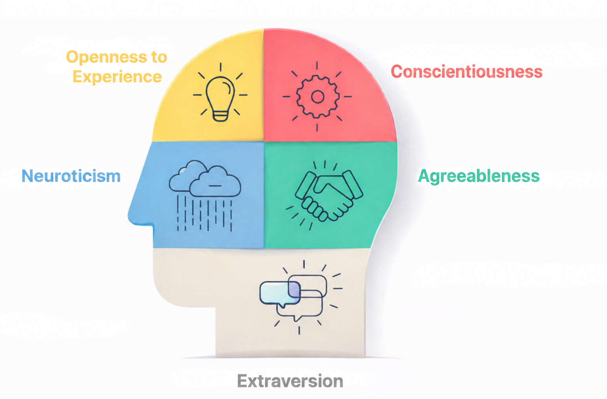
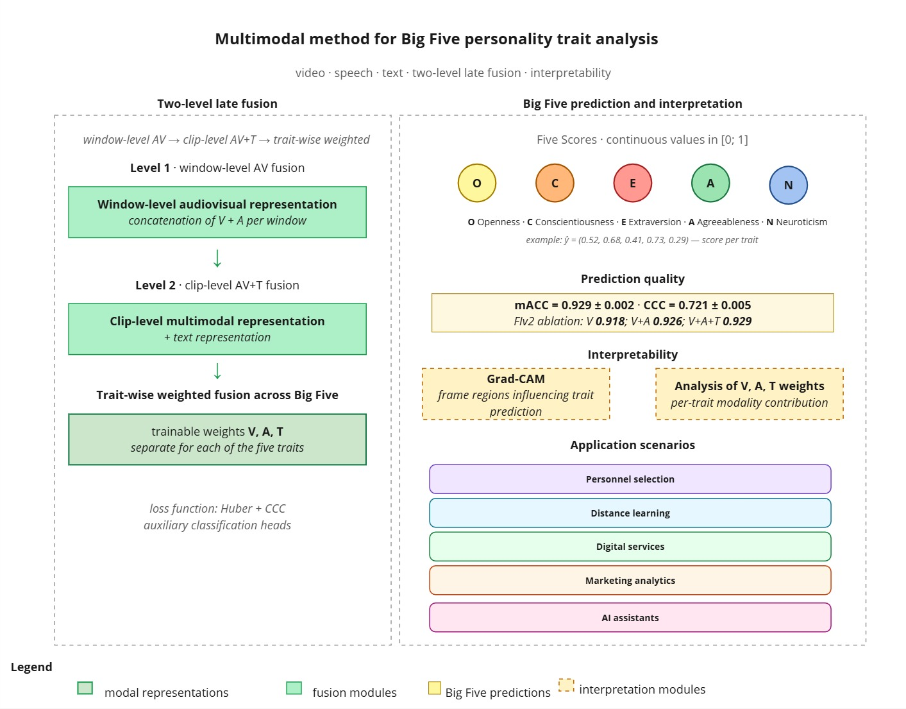
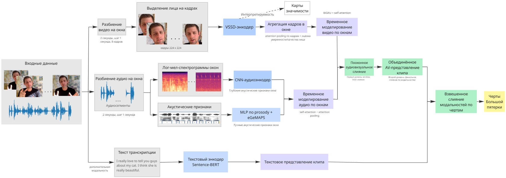
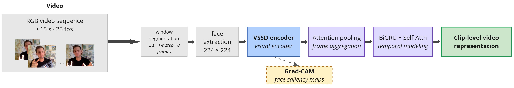
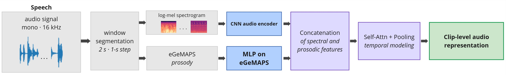
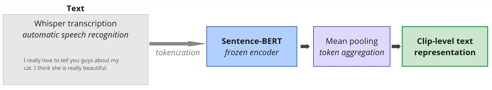
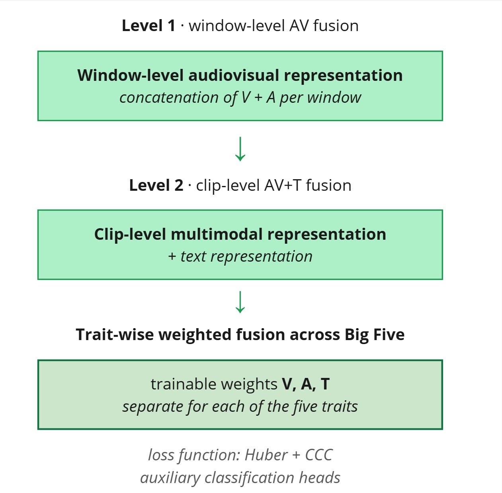
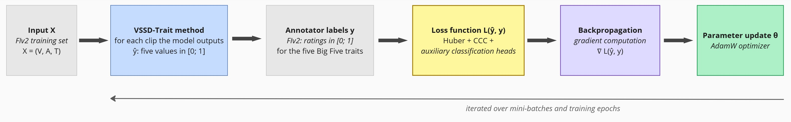
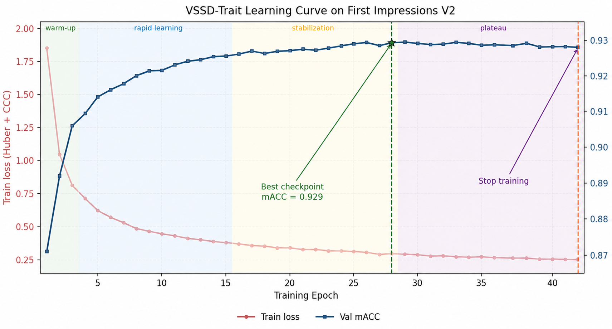

# Architecture

VSSD-Trait is a three-branch multimodal regressor for the **Big Five
personality traits** (Openness, Conscientiousness, Extraversion,
Agreeableness, Neuroticism) on 15-second self-presentation video clips
from the **First Impressions V2** corpus. The five target traits are
illustrated below.

<p align="center">
  
</p>

## Functional scheme

The method maps a multimodal input `(V, A, T)` — video, audio, text —
to a five-dimensional Big Five score `ŷ ∈ [0, 1]⁵`. The pipeline has
four stages: modality-specific preprocessing with windowing for `V`/`A`
(text is clip-level), three encoder branches, two-level late fusion,
and a trait-wise gated combination on top of which the interpretability
module operates.

<p align="center">
  
</p>

<p align="center">
  
</p>

A condensed end-to-end view of the same pipeline:

<p align="center">
  
</p>

## Visual branch (`src/av_traits/models/visual.py`)

<p align="center">
  
</p>

* **Windowing** — a 15 s clip at 25 FPS is split into **14 overlapping
  windows** of 2 s with 1 s stride; **K = 8 frames** are uniformly
  sampled per window. Overlapping windows match the typical duration
  of elementary mimic events.

<p align="center">
  
</p>

* **Face localization** — **RetinaFace** crops each sampled frame with
  a 20 % margin (to retain head pose, hairline and upper neck),
  resizes to 224 × 224 and normalises by ImageNet statistics.
  Missed detections are linearly interpolated from neighbours and
  down-weighted at frame aggregation.
* **Backbone** — **VSSD-Small** (`vssd_small_mesa.pth`, ICCV 2025), a
  state-space-duality vision model with **linear** complexity in token
  length. Pretrained on ImageNet-22k. Replaceable with `ResNet-50` or
  `ViT-B/16` (`backbone_kind: vssd | resnet50 | vit_b16`) for the
  architectural ablation in Table 2.
* **Frame aggregation** — attention pool over the K = 8 per-window
  frames. The pooling weights are multiplied by face-detection
  confidence so that occluded / low-quality frames contribute less.
* **Temporal modelling** — a 2-layer **biGRU** plus a single-block
  **multi-head self-attention** (residual + LayerNorm) gives every
  window a global temporal context.
* **Window aggregation** — attention pool over the W = 14 windows.
  The attention weights αw are exposed in the forward output and power
  Table 9 (temporal saliency).

## Audio branch (`src/av_traits/models/audio.py`)

<p align="center">
  
</p>

The speech signal is converted to mono 16 kHz, amplitude-normalised
and split into 2 s / 1 s windows whose boundaries are aligned with the
visual windows so that window-level AV fusion (§ Fusion) is locally
synchronised. Two parallel streams:

| Stream | Inputs | Architecture | Output dim |
| ------ | ------ | ------------ | ---------- |
| Deep   | log-mel (128 × T) | 2-D CNN (CNN10 pretrained on AudioSet) → adaptive avg-pool → MLP | 256 |
| HC     | prosody (38) ⊕ eGeMAPSv02 (88) | 2-layer MLP | 128 |

Streams are concatenated → `Linear(384 → 512)` and passed through a
self-attention + attention-pooling temporal module that mirrors the
visual one. Hand-crafted features come from **openSMILE**; the deep /
HC complementarity is what makes the audio branch carry the bulk of
Extraversion and Neuroticism (see fusion-weight analysis below).

## Text branch (`src/av_traits/models/text.py`)

<p align="center">
  
</p>

* Transcripts come from Whisper ASR; preprocessing is lowercasing,
  whitespace normalisation and tokenisation by the encoder's own
  tokenizer.
* **Sentence-BERT** (`all-MiniLM-L6-v2`, 22.7 M params, 6-layer
  compressed Transformer) — **frozen**, encodes the full transcript
  into a 384-dim sentence embedding.
* Mean-pooling over tokens → `Linear(384 → 512)` projection brings the
  representation into the shared hidden space.
* The text branch is **clip-level by design**: 2-second slices of a
  free-form monologue lose semantics, so the temporal granularity is
  intentionally coarser than for `V` and `A`.

The frozen Sentence-BERT weights are not counted in the trainable
parameter budget (Table 3).

## Two-level late fusion (`src/av_traits/models/fusion.py`)

<p align="center">
  
</p>

**Level 1 — window-level AV fusion.** Inside each of the 14 windows
the visual and acoustic representations are concatenated and projected
through a linear layer, letting the model pick up tight couplings
between mimic and prosodic events (e.g. a smile co-occurring with a
pitch rise) that would be averaged out at clip level. The window
sequence is then processed by the temporal module to form a single
clip-level AV vector.

**Level 2 — clip-level AV + T fusion.** The text embedding is
projected to the same dimensionality and added to the AV vector.
Text is attached at the clip level because video / audio dynamics are
fast whereas semantic content only resolves over the whole utterance.

**Trait-wise gating.** For every trait *t* and modality *m* we compute
a sigmoid score ŷ_{t,m} via a per-modality linear head, plus a
softmax gate α_{t,m} over modalities (per trait). The final prediction
is

The per-trait gate weights — averaged over the test set — are reported
in Table 8 and form the modality level of the interpretability module.

## Interpretability module

The model is interpretable on three levels:

1. **Modality level** — the learnt softmax weights `α_{t,m}` directly
   measure each modality's contribution to each trait (Table 8 /
   `docs/results.md`).
2. **Temporal level** — the per-window attention weights `α_w` over
   the 14 windows surface the moments the clip-level prediction
   relies on most (Table 9).
3. **Spatial level** — **Grad-CAM** adapted to a regression head:
   gradients of the predicted trait w.r.t. the last VSSD feature map
   are spatially averaged into channel weights, yielding per-frame
   saliency maps that are then combined into a clip-level map using
   the same attention weights as frame aggregation, so the spatial
   level is consistent with the temporal one.

<p align="center">
  
</p>

The Grad-CAM example above (trait = Neuroticism) concentrates on the
brow ridge, glabella and peri-orbital region — psychophysiological
markers of anxiety / emotional instability — with secondary maxima
around the mouth. Background pixels are near-zero.

## Auxiliary classification head (`BinHead`)

A small linear head on top of the joint embedding maps each trait to a
3-class soft label (low / mid / high, boundaries `0.40` / `0.60`).
Adds a cross-entropy term that empirically improves CCC by ~0.005.

## Loss (`src/av_traits/training/losses.py`)

```
L = L_huber                                        ← regression
  + λ_aux  · Σ_m L_huber(per-modality)            ← deep supervision
  + λ_ccc  · (1 − mean_CCC)                        ← align with metric
  + λ_bin  · CE(bin_logits)                        ← classification
  + λ_pair · L_pairwise(joint_emb)                 ← metric learning
```

Default coefficients: `λ_aux = 0.15, λ_ccc = 0.5, λ_bin = 0.2,
λ_pair = 0.1`. Disable `aux` or `ccc` via `cfg.use_aux_heads = False`
or `cfg.use_ccc_loss = False`.

## Training schedule

<p align="center">
  
</p>

Optimization is by **AdamW** with learning rate `1·10⁻⁴` for the
randomly-initialised modules and `1·10⁻⁵` for fine-tuning VSSD; the
text encoder is **frozen**. Training follows a 3-stage staged-unfreezing
curriculum:

| Stage | Epochs | Backbone   | LR (heads) | LR (backbone) |
| ----- | ------ | ---------- | ---------- | ------------- |
| 1     | 2      | frozen     | 3 × 10⁻⁴  | 0             |
| 2     | 4      | last stage | 1.5 × 10⁻⁴| 8 × 10⁻⁶     |
| 3     | 6      | all        | 8 × 10⁻⁵  | 3 × 10⁻⁶     |

Linear warmup (8 % of steps) → half-cosine decay; AMP enabled; gradient
accumulation = 2; max-norm clipping at 1.0. A full training run takes
~18 h on a single NVIDIA RTX 3090 (24 GB). The corresponding curves
of mACC and CCC across the three stages are shown below.

**Early stopping.** After every epoch the summary validation mACC is
evaluated and the best-so-far checkpoint kept; training halts once
the metric fails to improve by more than a negligible threshold for a
fixed observation window and the parameters are restored from that
checkpoint. The window is sized to exceed the characteristic noise
amplitude on the stabilization plateau, so the criterion is
reproducible without committing to a fixed epoch budget. 

<p align="center">
  
</p>
