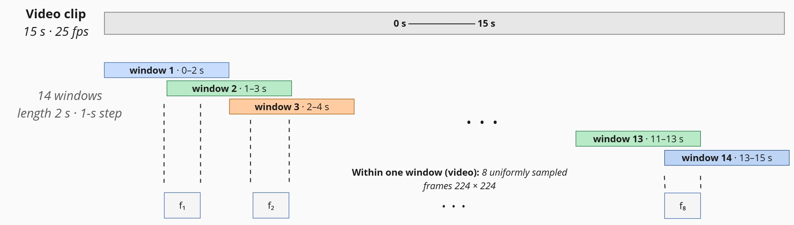

# Dataset

## Big Five target

Targets follow the **Big Five** model (McCrae & John, 1992) — five
continuous soft scores in `[0, 1]` per clip.

| Trait | Symbol | What it measures |
| ----- | ------ | ---------------- |
| **Openness** to experience | O | curiosity, imagination, aesthetic sensitivity |
| **Conscientiousness**      | C | organisation, dependability, self-discipline |
| **Extraversion**           | E | sociability, assertiveness, activity level |
| **Agreeableness**          | A | warmth, cooperation, trust |
| **Neuroticism**            | N | emotional instability, anxiety |

Big Five is the *de facto* annotation standard for modern multimodal
personality corpora, including the corpus used here.

## First Impressions V2

| Property             | Value                                                          |
| -------------------- | -------------------------------------------------------------- |
| Source               | ChaLearn LAP, ECCV 2016 / ECCV 2018 challenges                  |
| Modalities           | RGB video, audio (44.1 kHz, downsampled to 16 kHz), transcripts |
| Clips                | 10 000 (6 000 train / 2 000 val / 2 000 test)                  |
| Clip length          | 15 seconds (≈ 375 frames @ 25 FPS)                             |
| Targets              | Big Five soft scores in [0, 1]                                 |
| License              | Research-only (CC BY-NC-SA-like, ChaLearn agreement)            |

FIv2 was selected over MuPTA / YouTube-Personality / SSPNet-Speaker
because it is the only corpus that simultaneously offers (i) enough
clips to train multimodal models, (ii) all three modalities (video,
speech, transcript), (iii) standardised expert Big-Five annotations
and (iv) fixed train / val / test splits — which is what makes results
directly comparable with EmoFormer, CAT-BE, GSFN and SSL-MEPR.

The original release ships with three pickle files per split:

* `annotation_<split>.pkl` — soft Big Five scores per video, plus an
  ``interview`` rating;
* `transcription_<split>.pkl` — speaker transcripts (single string per video);
* the videos themselves as `*.mp4`.

## On-disk layout expected by the project

```
$DATA_ROOT/
├── TRAIN/
│   ├── *.mp4
│   └── Annotation/
│       ├── annotation_training.pkl
│       └── transcription_training.pkl
├── VALIDATION/
│   ├── *.mp4
│   └── Annotation/
│       ├── annotation_validation.pkl
│       └── transcription_validation.pkl
└── TEST/
    ├── *.mp4
    └── Annotation/
        ├── annotation_test.pkl
        └── transcription_test.pkl
```

`av_traits.data.manifests.build_manifest_from_local` walks this tree
and produces a `pandas.DataFrame` with one row per clip:

```
split | video_id | video_path | transcription | openness | conscientiousness | extraversion | agreeableness | neuroticism
```

## Window decomposition

Both the visual and acoustic branches consume a clip as a sequence of
14 overlapping 2 s windows with 1 s stride. Window boundaries are
shared across modalities so that level-1 fusion (window-level AV
concat) is locally synchronised — see [`architecture.md`](architecture.md#two-level-late-fusion-srcav_traitsmodelsfusionpy).

<p align="center">
  
</p>

Inside each visual window, **K = 8** frames are uniformly sampled and
cropped to 224 × 224 around the face. The text branch operates on the
full transcript (no windowing).

## Feature cache

Each clip is preprocessed once and the results are dumped to a single
`*.pt` file under `$CACHE_ROOT/video/<split>/<video_id>.pt` containing:

| Key            | dtype       | Shape                       | Description                                  |
| -------------- | ----------- | --------------------------- | -------------------------------------------- |
| `faces`        | uint8       | `[W, K, H, W, 3]`           | RetinaFace-cropped 224×224 faces (RGB).      |
| `face_scores`  | float32     | `[W, K]`                    | Confidence per face crop (0/1 = detector/center fallback). |
| `mel`          | float32     | `[128, T]`                  | log-mel spectrogram (z-score normalised).    |
| `prosody`      | float32     | `[38]`                      | rms / zcr / f0 statistics + mean/std MFCC.   |
| `ege_maps`     | float32 \| None | `[88]`                  | eGeMAPSv02 functionals (None if openSMILE failed). |
| `target`       | float32     | `[5]`                       | Soft Big Five scores in [0, 1].              |
| `transcription`| str         | —                           | Full transcript string.                      |

W = `cfg.train_windows` / `cfg.eval_windows`; K = frames per window.

Run-once command:

```bash
python scripts/precache_features.py \
    --data-root $DATA_ROOT --cache-root $CACHE_ROOT
```

The script also extracts a 16 kHz mono `*.wav` per clip into
`$CACHE_ROOT/audio/`, used by `librosa` and `openSMILE` so that audio
decoding happens at most once. Pre-caching FIv2 end-to-end costs about
**2.5 h on a single GPU** and is paid only once.

## Splits used by experiments

* All training is on the **train** split.
* Validation metrics drive model selection (best-by `ccc + 0.25·macc`).
* All headline numbers (Tables 1–11) are reported on the **test** split.
* Final test metrics are measured **once** without further tuning, so
  numbers are directly comparable to EmoFormer, CAT-BE, GSFN and
  SSL-MEPR.
