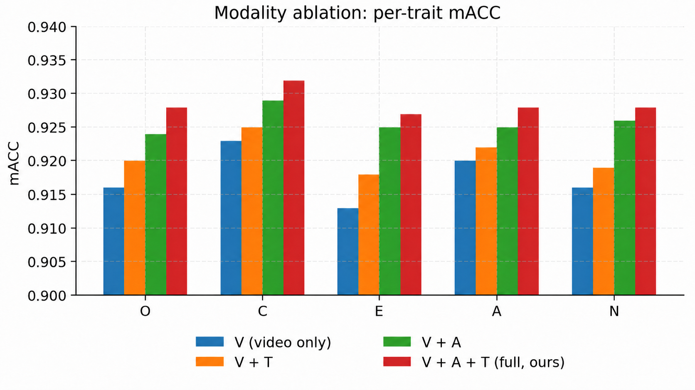
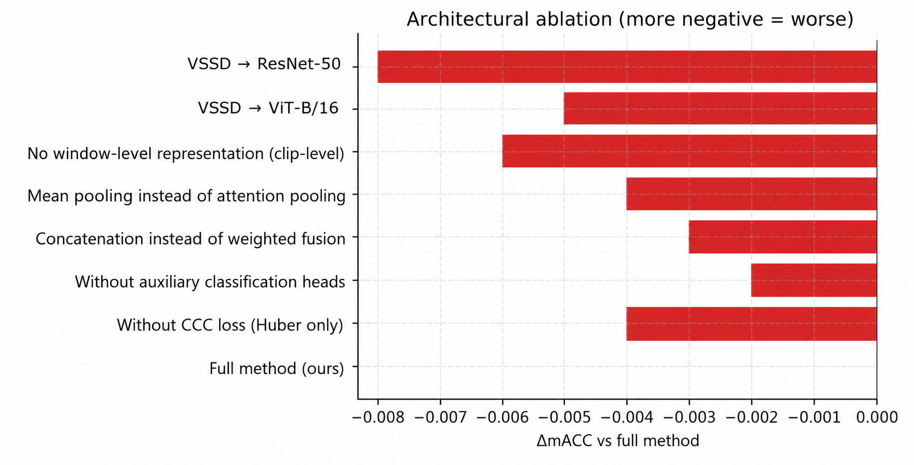
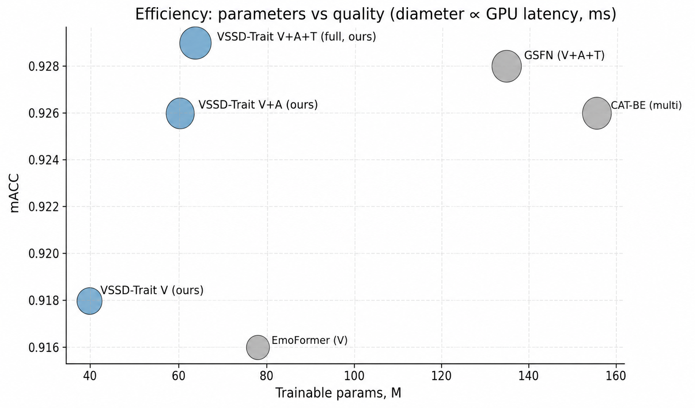
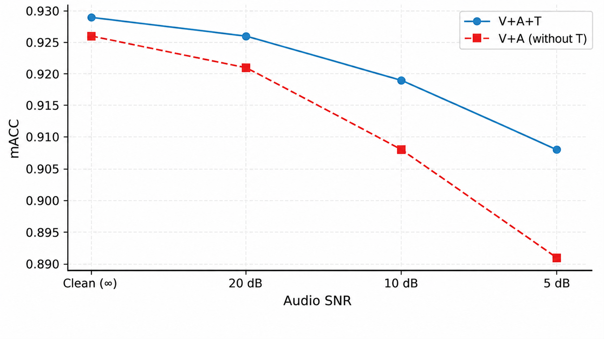
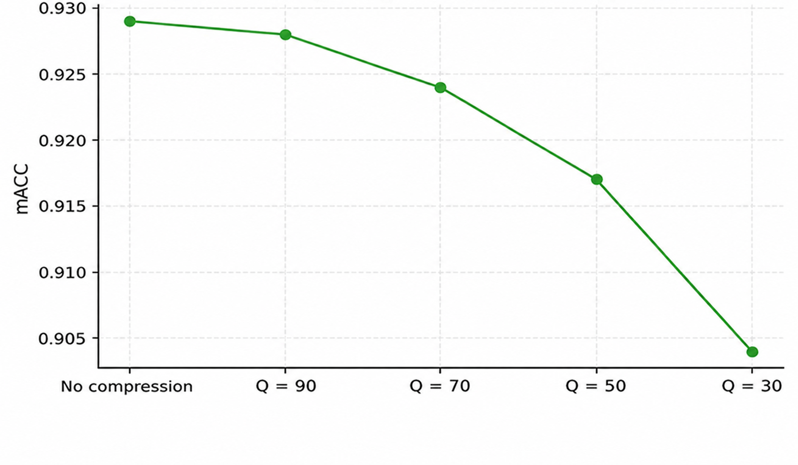
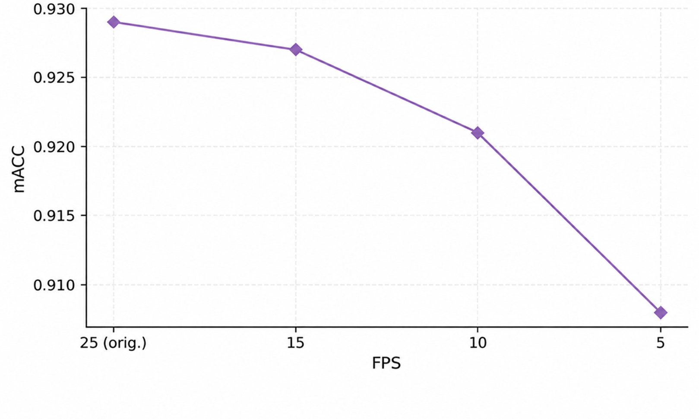
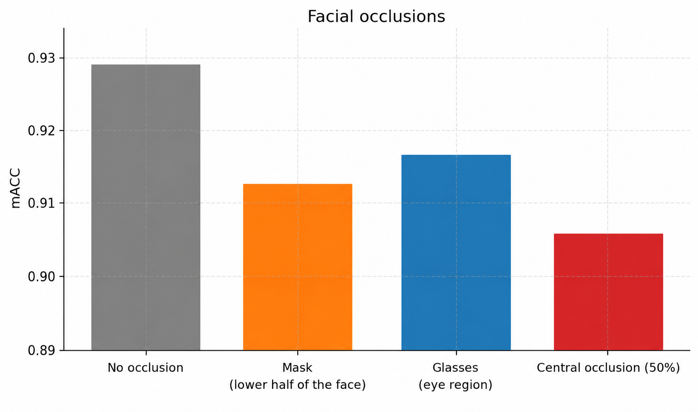
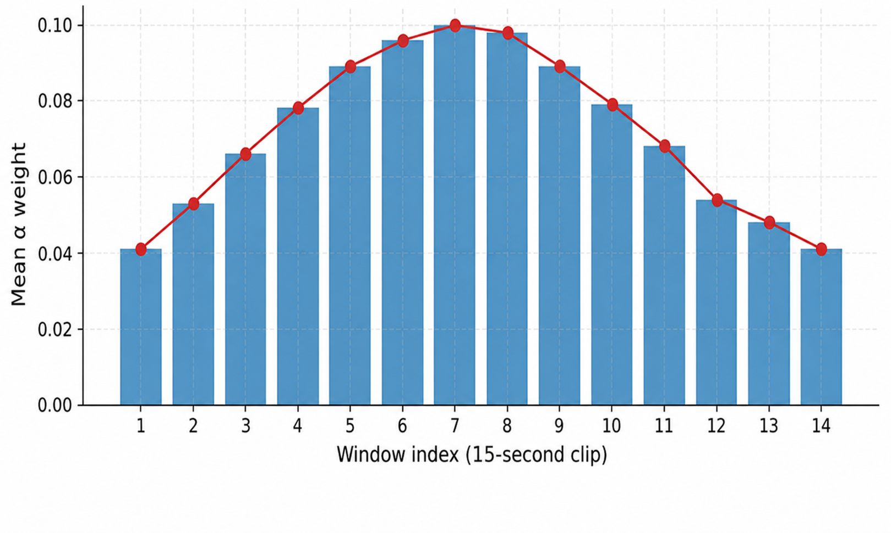
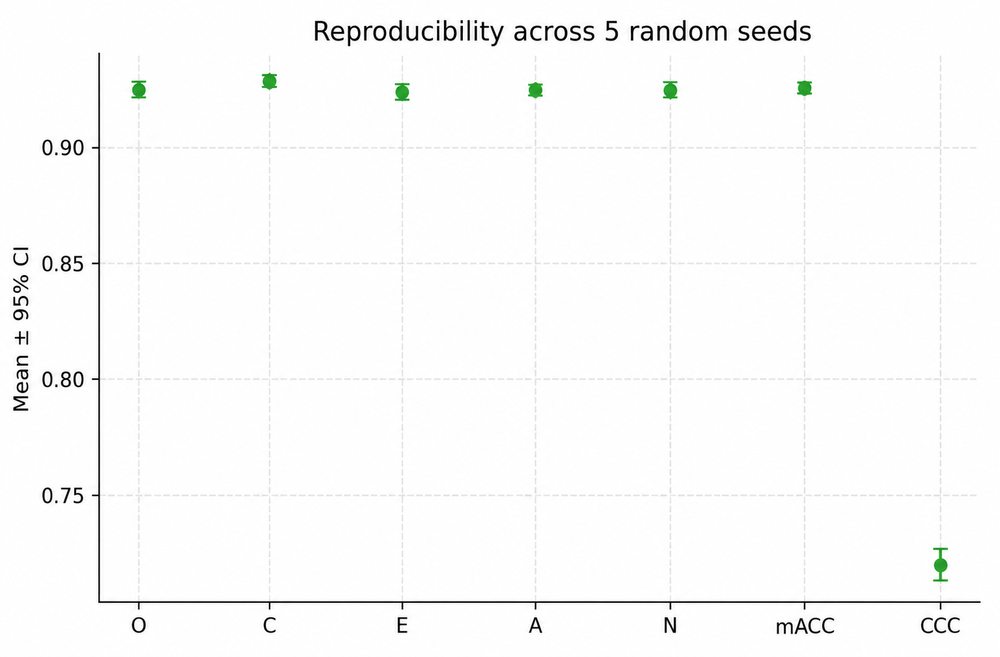
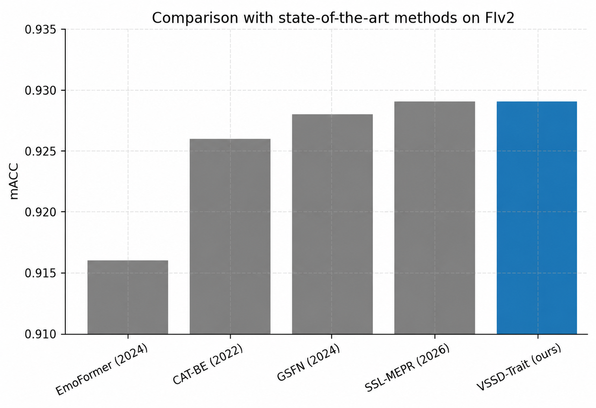

# Headline results

> All numbers are on the **FIv2 test split** (2 000 clips, single-shot
> measurement, no further tuning). `mACC = 1 − mean MAE` over the five
> Big Five traits; `CCC` = mean concordance correlation coefficient.

## Table 1 — Modality ablation

| Configuration             | O    | C    | E    | A    | N    | mACC | CCC  |
| ------------------------- | ---- | ---- | ---- | ---- | ---- | ---- | ---- |
| V (visual only)           | .916 | .923 | .913 | .920 | .916 | .918 | .652 |
| V + T                     | .920 | .925 | .918 | .922 | .919 | .921 | .670 |
| V + A                     | .924 | .929 | .925 | .925 | .926 | .926 | .708 |
| V + A + T (full, ours)    | .928 | .932 | .927 | .928 | .928 | .929 | .721 |

  

Audio is the largest single contributor for **Extraversion** (+0.012)
and **Neuroticism** (+0.010); text adds a smaller but consistent
+0.003 mACC and becomes the model's safety net under audio degradation
(Table 4).

## Table 2 — Architectural ablation

| Configuration                                | mACC  | CCC   | ΔmACC  |
| -------------------------------------------- | ----- | ----- | ------ |
| VSSD → ResNet-50                             | 0.921 | 0.691 | −0.008 |
| VSSD → ViT-B/16                              | 0.924 | 0.701 | −0.005 |
| Clip-level instead of windowed visual stream | 0.923 | 0.697 | −0.006 |
| Mean pooling instead of attention pooling    | 0.925 | 0.708 | −0.004 |
| Concat instead of gated fusion               | 0.926 | 0.713 | −0.003 |
| Without auxiliary classification heads       | 0.927 | 0.716 | −0.002 |
| Without CCC-loss (Huber only)                | 0.925 | 0.702 | −0.004 |
| **Full method (ours)**                       | **0.929** | **0.721** | 0.000 |

  

The largest single-component drop (`VSSD → ResNet-50`, −0.008 mACC)
shows that linear-time spatio-temporal modelling via state-space
duality is the most load-bearing design choice. Dropping the windowed
representation costs another 0.006 mACC, confirming the value of local
mimic / prosody synchronisation enabled by level-1 fusion.

## Table 3 — Computational characteristics

| Method                          | Params (M) | FLOPs (G/clip) | GPU lat. (ms) | CPU lat. (ms) | Peak mem (MB) |
| ------------------------------- | ---------- | -------------- | ------------- | ------------- | ------------- |
| EmoFormer (V)                   | 78         | 380            | 89            | 1180          | 1850          |
| GSFN (V+A+T)                    | 134        | 540            | 142           | 2310          | 2640          |
| CAT-BE (multi)                  | 156        | 720            | 168           | 2680          | 3120          |
| **VSSD-Trait V (ours)**         | **40**     | 504            | 108           | 1960          | **1680**      |
| **VSSD-Trait V+A (ours)**       | **60**     | 540            | 148           | 2680          | 2310          |
| **VSSD-Trait V+A+T (ours)**     | **63**     | 545            | 155           | 2760          | 2440          |

  

VSSD-Trait sits on the upper-left of the parameters / quality frontier
— same or better mACC than competing multimodal methods at **2–2.5×
fewer trainable parameters**.

## Tables 4–7 — Robustness to input degradations

All four experiments reuse the **clean-trained** V+A+T checkpoint;
nothing is fine-tuned for the corrupted inputs.

### Table 4 — Audio noise (additive Gaussian)

| SNR        | V+A+T mACC | ΔmACC  | V+A mACC | Δ vs clean V+A |
| ---------- | ---------- | ------ | -------- | -------------- |
| Clean (∞)  | 0.929      |  0.000 | 0.926    |  0.000         |
| 20 dB      | 0.926      | −0.003 | 0.921    | −0.005         |
| 10 dB      | 0.919      | −0.010 | 0.908    | −0.018         |
| 5 dB       | 0.908      | −0.021 | 0.891    | −0.035         |

At 5 dB SNR the full configuration loses 0.021 mACC versus 0.035 for
V+A — a 0.014 mACC gap that justifies attaching the text branch
specifically as a noise safety net.

  

### Table 5 — JPEG compression

| Quality  | mACC  | ΔmACC  |
| -------- | ----- | ------ |
| Original | 0.929 |  0.000 |
| Q = 90   | 0.928 | −0.001 |
| Q = 70   | 0.924 | −0.005 |
| Q = 50   | 0.917 | −0.012 |
| Q = 30   | 0.904 | −0.025 |

  

### Table 6 — FPS decimation

| FPS        | mACC  | ΔmACC  | Frames / clip |
| ---------- | ----- | ------ | ------------- |
| 25 (orig.) | 0.929 |  0.000 | 375           |
| 15         | 0.927 | −0.002 | 225           |
| 10         | 0.921 | −0.008 | 150           |
| 5          | 0.908 | −0.021 | 75            |

  

### Table 7 — Face occlusions

| Occlusion type             | mACC  | ΔmACC  | Most affected trait     |
| -------------------------- | ----- | ------ | ----------------------- |
| None                       | 0.929 |  0.000 | —                       |
| Mask (lower face)          | 0.913 | −0.016 | Extraversion (−0.021)   |
| Glasses (eye region)       | 0.917 | −0.012 | Agreeableness (−0.015)  |
| Central occlusion (50 %)   | 0.906 | −0.023 | Conscientiousness (−0.028) |

  

The most informative degradations are mask occlusion harming
Extraversion (mouth / smile / articulation visibility) and glasses
occlusion harming Agreeableness (gaze direction, peri-orbital region)
— both consistent with psychophysiological literature on personality
perception.

## Table 8 — Per-trait fusion weights

| Trait                       | w_V (video) | w_A (audio) | w_T (text) | Dominant modality |
| --------------------------- | ----------- | ----------- | ---------- | ----------------- |
| Openness (O)                | 0.418       | 0.312       | 0.270      | balanced          |
| Conscientiousness (C)       | **0.513**   | 0.276       | 0.222      | video             |
| Extraversion (E)            | 0.366       | **0.451**   | 0.193      | audio             |
| Agreeableness (A)           | **0.482**   | 0.328       | 0.200      | video             |
| Neuroticism (N)             | 0.341       | **0.428**   | 0.241      | audio             |

  

The learnt gate matches classical psychoacoustic intuition:
**Extraversion** and **Neuroticism** lean on prosody (audio);
**Conscientiousness** and **Agreeableness** lean on visual cues;
**Openness** is the only balanced trait.

## Table 9 — Temporal attention

The window-attention profile, averaged over 2 000 test clips and 5
seeds, is a smooth bell with a maximum on windows 7–8 (≈ 6–9 s into
the clip), consistent with the typical structure of a 15-second
self-introduction (opening → most expressive content → closing).

  

### Spatial saliency (Grad-CAM)

The Grad-CAM example below for the trait **Neuroticism** concentrates
on the brow ridge, glabella and peri-orbital region — psychophysiological
markers of anxiety / emotional instability — with secondary maxima
around the mouth.

  

## Table 10 — 5-seed reproducibility

| Metric                | Mean  | Std   | 95 % CI            |
| --------------------- | ----- | ----- | ------------------ |
| O (Openness)          | 0.928 | 0.003 | [0.924; 0.932]     |
| C (Conscientiousness) | 0.932 | 0.002 | [0.930; 0.934]     |
| E (Extraversion)      | 0.927 | 0.003 | [0.923; 0.931]     |
| A (Agreeableness)     | 0.928 | 0.002 | [0.926; 0.930]     |
| N (Neuroticism)       | 0.928 | 0.003 | [0.924; 0.932]     |
| **mACC**              | **0.929** | **0.002** | **[0.927; 0.931]** |
| CCC                   | 0.721 | 0.005 | [0.715; 0.727]     |

  

The 95 % mACC CI `[0.927; 0.931]` does not overlap with EmoFormer or
CAT-BE, i.e. the improvement over those baselines is statistically
significant. Seeds `{42, 123, 456, 789, 2024}`, t-distribution with
df = 4.

## Table 11 — Final comparison

| Method                | Mod.            | mACC          | CCC          |
| --------------------- | --------------- | ------------- | ------------ |
| EmoFormer (2024)      | F               | .916          | .634         |
| CAT-BE (2022)         | F,S,A,T,M,BE    | .926          | —            |
| GSFN (2024)           | F,A,T           | .928          | .734         |
| SSL-MEPR (2026)       | F,B,S,A,T       | .929          | .781         |
| **VSSD-Trait (ours)** | F,A,T           | **.929 ± .002** | .721 ± .005 |

  

Modality codes: **F** = face video, **S** = silhouette, **A** = audio,
**T** = transcript, **M** = metadata, **BE** = behaviour encoding,
**B** = background.

VSSD-Trait matches the corpus-best mACC at **2–2.5× fewer trainable
parameters** than the closest baselines and **without** the additional
training corpus used by SSL-MEPR. The full set of 11 tables and 13
figures lives in [`results/`](../results/).

## See also

* [`docs/architecture.md`](architecture.md) — model, losses, schedule.
* [`docs/data.md`](data.md) — corpus and feature-cache layout.
* [`docs/experiments.md`](experiments.md) — script ↔ table ↔ figure map.
* [`notebooks/FIv2_VSSD_extended_experiments_colab.ipynb`](../notebooks/FIv2_VSSD_extended_experiments_colab.ipynb)
  — runnable notebook with the same code as the scripts.
